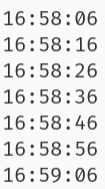

# Лабораторная Работа №3

> Выполнил: Шардт М.А., гр. ИВТ-1.1

## Комплект 1: Классы. Объекты.

### 1.1: : Определите объект автомобиль, используя простой литеральный объект. Определите 2 свойства brand, speed и 3 метода accelerate, brake, describe (ускорение, торможение, описание). Продемонстрируйте работу методов на свойствах объекта с помощью console.log(...).

```js
const car = {
    brand: "Ford",
    speed: "80",
    accelerate: () => console.log("Hit the gas!"),
    brake: () => console.log("Braking..."),
    describe: () => console.log("The Ford Pinto is a subcompact car."),
}

car.accelerate()
car.brake()
car.describe()
```

#### Резултат выполнения


### 1.2: Определите объект автомобиль из задачи 1.1 с помощью функцииконструктора. Продемонстрируйте работу методов на свойствах объекта с помощью console.log(...).

```js
function Car(brand, speed, accelerate, brake, describe) {
    this.brand = brand
    this.speed = speed
    this.describe = describe
    this.accelerate = accelerate
    this.brake = brake
}

const car = new Car(
    "Volkswagen",
    202,
    () =>
        console.log(
            "First light commercial vehicle and second Volkswagen car model."
        ),
    () => console.log("Braking..."),
    () => console.log("Accelerating...")
)
car.accelerate()
car.brake()
car.describe()
```
- 

#### Резултат выполнения


### 1.3: Определите объект автомобиль из задачи 1.2 с помощью ключевого слова class.

```js
class Car {
    constructor(brand, speed, accelerate, brake, describe) {
        this.brand = brand
        this.speed = speed
        this.brake = brake
        this.describe = describe
        this.accelerate = accelerate
    }
}
```

### 1.4: Реализуйте класс class Product со свойствами name, price и методом toString(). Реализуйте класс class ShoppingCart с массивом продуктов внутри и методом addProduct() для добавления продукта, а также методом bill(), который возвращает многосрочный "чек" с именами продуктов, ценами и общей стоимостью корзины. Распечатайте после вызова bill() этот чек в консоли.

```js
class Product {
    constructor(name, price) {
        this.name = name
        this.price = price
    }

    toString() {
        return this.name + ": $" + this.price
    }
}

class ShoppingCart {
    constructor(products = []) {
        this.products = products
    }

    addProduct(product) {
        this.products.push(product)
    }

    bill() {
        const formattedProducts =
            this.products
                .map((e, i) => `${i + 1}. ${e.toString()}`)
                .join("\n") + "\n"
        const totalCost = this.products.reduce(
            (total, current) => total + current.price,
            0
        )

        const bill = `${formattedProducts}\nTotal: $${totalCost}`
        console.log(bill)
        return bill
    }
}

// Create products
const products = [new Product("Apples", 1.28), new Product("Milk", 4.41)]
// Create shopping cart
const cart = new ShoppingCart(products)
// Add product to shopping cart
cart.addProduct(new Product("Cookies", 2.3))
// Print the bill
cart.bill()
```

#### Результат выполнения


### 1.5: Создайте новый класс class ExtendedClock, который будет наследоваться от Clock и добавьте параметр precision – количество миллисекунд между "тиками" часов. Установите значение в 10000 (10 секунд) по умолчанию. Продемонстрируйте работу class ExtendedClock, создав экземпляр этого класса и вызвав метод start().

```js
class Clock {...}

class ExtendedClock extends Clock {
    constructor({ template, precision = 10000 }) {
        super({ template })
        this.precision = precision
    }

    start() {
        super.render()
        this.timer = setInterval(() => super.render(), this.precision)
    }
}

const settings = {
    template: "h:m:s",
    // precision: 3000,
}
const clock = new ExtendedClock(settings)
clock.start()
```

### Результаты работы 

1. Не предоставляя значения precision<br>

2. При значении precision равном 3000<br>
